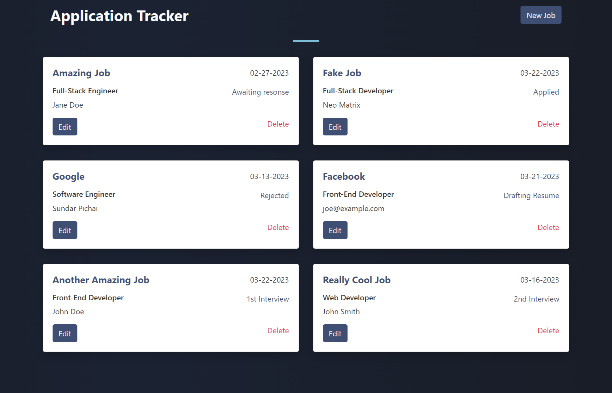

# README

Things you may want to cover:

* Ruby version 3.2.0
* [Rails 7](https://rubyonrails.org/)
* [Tailwind](https://tailwindcss.com/docs/guides/ruby-on-rails)

* Database creation
Run `rails db:migrate` then `bundle install`

* Deployment instructions
Run `bin/dev` or `rail s` to start the server.

*Note*
Tailwind has a separate watch process for running in development. In your terminal, open another tab and run either `rails tailwindcss:watch` or by running `./bin/dev`.

* ...
